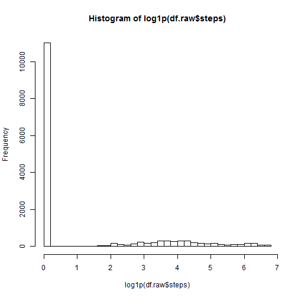
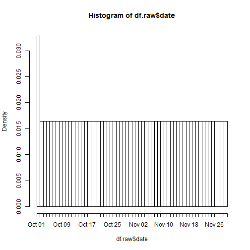
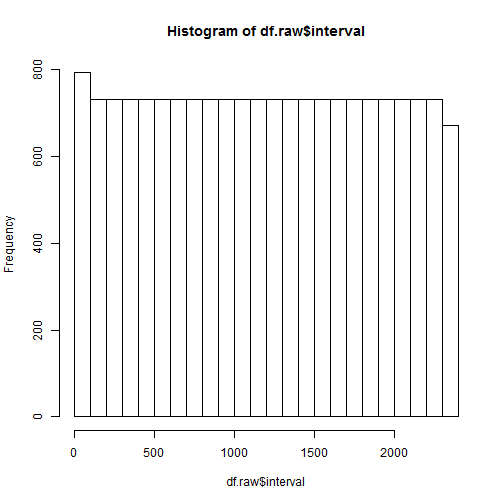
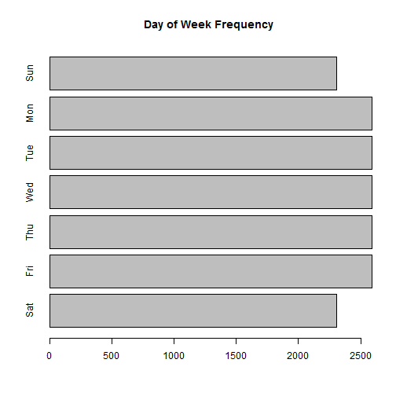
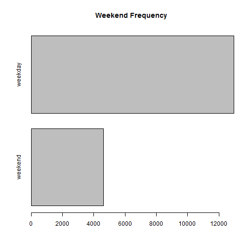
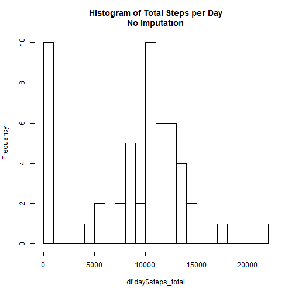
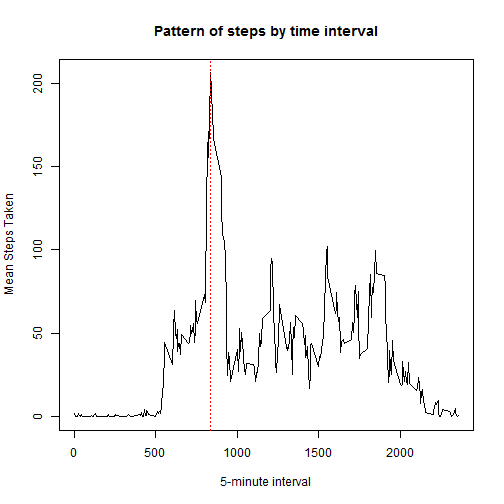
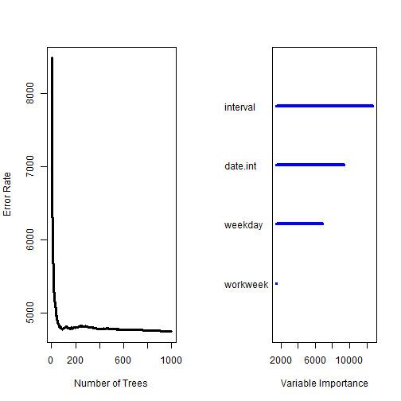
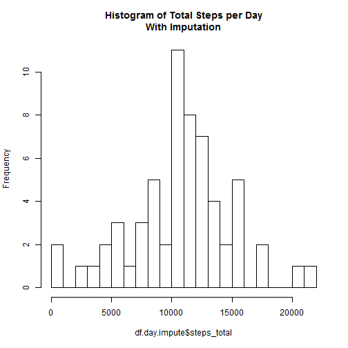
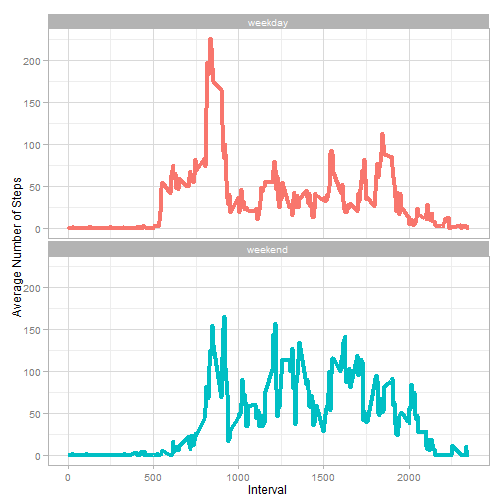

## Loading and preprocessing the data

```r
require(dplyr)
```

```
## Loading required package: dplyr
## 
## Attaching package: 'dplyr'
## 
## The following objects are masked from 'package:stats':
## 
##     filter, lag
## 
## The following objects are masked from 'package:base':
## 
##     intersect, setdiff, setequal, union
```

```r
str(df.raw <- unz(
  'activity.zip'
  ,'activity.csv'
  ) %>%
  read.csv(  
    colClasses=c(
      'integer'
      ,'Date'
      ,'integer'
      )
    ) %>%
  mutate(
    weekday = factor(
      weekdays(date, abbreviate=TRUE)
      ,levels=c('Sun','Mon','Tue','Wed','Thu','Fri','Sat')
      )
    ,workweek = factor(ifelse(
      weekday %in% c('Sat', 'Sun')
      ,'weekend'
      ,'weekday'
      ))
    ,date.int = as.integer(date)
    ))
```

```
## 'data.frame':	17568 obs. of  6 variables:
##  $ steps   : int  NA NA NA NA NA NA NA NA NA NA ...
##  $ date    : Date, format: "2012-10-01" "2012-10-01" ...
##  $ interval: int  0 5 10 15 20 25 30 35 40 45 ...
##  $ weekday : Factor w/ 7 levels "Sun","Mon","Tue",..: 2 2 2 2 2 2 2 2 2 2 ...
##  $ workweek: Factor w/ 2 levels "weekday","weekend": 1 1 1 1 1 1 1 1 1 1 ...
##  $ date.int: int  15614 15614 15614 15614 15614 15614 15614 15614 15614 15614 ...
```

```r
summary(df.raw)
```

```
##      steps            date               interval    weekday   
##  Min.   :  0.0   Min.   :2012-10-01   Min.   :   0   Sun:2304  
##  1st Qu.:  0.0   1st Qu.:2012-10-16   1st Qu.: 589   Mon:2592  
##  Median :  0.0   Median :2012-10-31   Median :1178   Tue:2592  
##  Mean   : 37.4   Mean   :2012-10-31   Mean   :1178   Wed:2592  
##  3rd Qu.: 12.0   3rd Qu.:2012-11-15   3rd Qu.:1766   Thu:2592  
##  Max.   :806.0   Max.   :2012-11-30   Max.   :2355   Fri:2592  
##  NA's   :2304                                        Sat:2304  
##     workweek        date.int    
##  weekday:12960   Min.   :15614  
##  weekend: 4608   1st Qu.:15629  
##                  Median :15644  
##                  Mean   :15644  
##                  3rd Qu.:15659  
##                  Max.   :15674  
## 
```

```r
hist(log1p(df.raw$steps), breaks='FD')
```

 

```r
hist(df.raw$date, breaks='day')
```

 

```r
hist(df.raw$interval, breaks='FD')
```

 

```r
df.raw$weekday %>%
  table %>%
  rev %>%
  barplot(
    horiz=TRUE
    ,main='Day of Week Frequency'
    )
```

 

```r
df.raw$workweek %>%
  table %>%
  sort %>%
  barplot(
    horiz=TRUE
    ,main='Weekend Frequency'
    )
```

 


## What is mean total number of steps taken per day?

```r
str(df.day <- df.raw %>%
  group_by(date) %>%
  summarize(
    steps_mean = mean(steps, na.rm=TRUE)
    ,steps_median = median(steps, na.rm=TRUE)
    ,steps_total = sum(steps, na.rm=TRUE)
    ) %>%
  arrange(date))
```

```
## Classes 'tbl_df', 'tbl' and 'data.frame':	61 obs. of  4 variables:
##  $ date        : Date, format: "2012-10-01" "2012-10-02" ...
##  $ steps_mean  : num  NaN 0.438 39.417 42.069 46.16 ...
##  $ steps_median: int  NA 0 0 0 0 0 0 NA 0 0 ...
##  $ steps_total : int  0 126 11352 12116 13294 15420 11015 0 12811 9900 ...
```

```r
summary(df.day)
```

```
##       date              steps_mean     steps_median  steps_total   
##  Min.   :2012-10-01   Min.   : 0.14   Min.   :0     Min.   :    0  
##  1st Qu.:2012-10-16   1st Qu.:30.70   1st Qu.:0     1st Qu.: 6778  
##  Median :2012-10-31   Median :37.38   Median :0     Median :10395  
##  Mean   :2012-10-31   Mean   :37.38   Mean   :0     Mean   : 9354  
##  3rd Qu.:2012-11-15   3rd Qu.:46.16   3rd Qu.:0     3rd Qu.:12811  
##  Max.   :2012-11-30   Max.   :73.59   Max.   :0     Max.   :21194  
##                       NA's   :8       NA's   :8
```

```r
hist(
  df.day$steps_total
  ,breaks=30
  ,main='Histogram of Total Steps per Day\nNo Imputation'
  )
```

 

```r
print(steps.per.day.mean <- mean(df.day$steps_total, na.rm=TRUE))
```

```
## [1] 9354
```

```r
print(steps.per.day.median <- median(df.day$steps_total, na.rm=TRUE))
```

```
## [1] 10395
```
  * Mean number of steps per day prior to imputation was 9354.2295
  * Median number of steps per day prior to imputation was 10395


## What is the average daily activity pattern?

```r
str(df.interval <- df.raw %>%
  group_by(interval) %>%
  summarize(
    steps_mean = mean(steps, na.rm=TRUE)
    ,steps_median = median(steps, na.rm=TRUE)
    ,steps_total = sum(steps, na.rm=TRUE)
    ) %>%
  arrange(interval))
```

```
## Classes 'tbl_df', 'tbl' and 'data.frame':	288 obs. of  4 variables:
##  $ interval    : int  0 5 10 15 20 25 30 35 40 45 ...
##  $ steps_mean  : num  1.717 0.3396 0.1321 0.1509 0.0755 ...
##  $ steps_median: int  0 0 0 0 0 0 0 0 0 0 ...
##  $ steps_total : int  91 18 7 8 4 111 28 46 0 78 ...
```

```r
with(df.interval,plot(
  x=interval
  ,y=steps_mean
  ,type='l'
  ,xlab='5-minute interval'
  ,ylab='Mean Steps Taken'
  ,main='Pattern of steps by time interval'
  ))
print(interval.max.steps <- with(df.interval, interval[which.max(steps_mean)]))
```

```
## [1] 835
```

```r
abline(v=interval.max.steps,lty=3,col='red')
```

 
  * The 5-minute interval with the highest average steps taken was interval 835


## Imputing missing values
  * There are 2304 rows with missing values.
  * Since only one variable has missing values, imputation was done as a classic supervised learning problem.
  * A Random Forest algorithm was used to learn from the observed step counts and predict the missing ones.

```r
require(randomForestSRC)
```

```
## Loading required package: randomForestSRC
## Loading required package: parallel
## 
##  randomForestSRC 1.5.5 
##  
##  Type rfsrc.news() to see new features, changes, and bug fixes. 
## 
```

```r
rf.fit <- rfsrc(
  steps ~ .
  ,data=df.raw %>% filter(!is.na(steps)) %>% select(-date)
  ,ntree=1000
  ,mtry=2
  )
print(rf.fit)
```

```
##                          Sample size: 15264
##                      Number of trees: 1000
##           Minimum terminal node size: 5
##        Average no. of terminal nodes: 1206
## No. of variables tried at each split: 2
##               Total no. of variables: 4
##                             Analysis: RF-R
##                               Family: regr
##                       Splitting rule: regr
##                 % variance explained: 62.14
##                           Error rate: 4749
```

```r
plot(rf.fit)
```

 

```
## 
##            Importance   Relative Imp
## interval        12709         1.0000
## date.int         9372         0.7374
## weekday          6851         0.5390
## workweek         1496         0.1177
```

```r
print(rf.predict <- rf.fit %>%
  predict(
    newdata=df.raw %>% filter(is.na(steps)) %>% select(-date, -steps)
    ))
```

```
##   Sample size of test (predict) data: 2304
##                 Number of grow trees: 1000
##   Average no. of grow terminal nodes: 1206
##          Total no. of grow variables: 4
##                             Analysis: RF-R
##                               Family: regr
```

```r
str(df.impute <- df.raw %>%
  mutate(
    steps.filled = steps
    ,imputed = is.na(steps)
    ))
```

```
## 'data.frame':	17568 obs. of  8 variables:
##  $ steps       : int  NA NA NA NA NA NA NA NA NA NA ...
##  $ date        : Date, format: "2012-10-01" "2012-10-01" ...
##  $ interval    : int  0 5 10 15 20 25 30 35 40 45 ...
##  $ weekday     : Factor w/ 7 levels "Sun","Mon","Tue",..: 2 2 2 2 2 2 2 2 2 2 ...
##  $ workweek    : Factor w/ 2 levels "weekday","weekend": 1 1 1 1 1 1 1 1 1 1 ...
##  $ date.int    : int  15614 15614 15614 15614 15614 15614 15614 15614 15614 15614 ...
##  $ steps.filled: int  NA NA NA NA NA NA NA NA NA NA ...
##  $ imputed     : logi  TRUE TRUE TRUE TRUE TRUE TRUE ...
```

```r
mean(df.impute$steps.filled[df.impute$imputed] <- rf.predict$predicted)
```

```
## [1] 34.83
```

```r
summary(df.impute)
```

```
##      steps            date               interval    weekday   
##  Min.   :  0.0   Min.   :2012-10-01   Min.   :   0   Sun:2304  
##  1st Qu.:  0.0   1st Qu.:2012-10-16   1st Qu.: 589   Mon:2592  
##  Median :  0.0   Median :2012-10-31   Median :1178   Tue:2592  
##  Mean   : 37.4   Mean   :2012-10-31   Mean   :1178   Wed:2592  
##  3rd Qu.: 12.0   3rd Qu.:2012-11-15   3rd Qu.:1766   Thu:2592  
##  Max.   :806.0   Max.   :2012-11-30   Max.   :2355   Fri:2592  
##  NA's   :2304                                        Sat:2304  
##     workweek        date.int      steps.filled  imputed       
##  weekday:12960   Min.   :15614   Min.   :  0   Mode :logical  
##  weekend: 4608   1st Qu.:15629   1st Qu.:  0   FALSE:15264    
##                  Median :15644   Median :  0   TRUE :2304     
##                  Mean   :15644   Mean   : 37   NA's :0        
##                  3rd Qu.:15659   3rd Qu.: 20                  
##                  Max.   :15674   Max.   :806                  
## 
```


### Now repeat the earlier day analysis of steps per day

```r
str(df.day.impute <- df.impute %>%
  group_by(date) %>%
  summarize(
    steps_mean = mean(steps.filled)
    ,steps_median = median(steps.filled)
    ,steps_total = sum(steps.filled)
    ) %>%
  arrange(date))
```

```
## Classes 'tbl_df', 'tbl' and 'data.frame':	61 obs. of  4 variables:
##  $ date        : Date, format: "2012-10-01" "2012-10-02" ...
##  $ steps_mean  : num  17.726 0.438 39.417 42.069 46.16 ...
##  $ steps_median: num  7.73 0 0 0 0 ...
##  $ steps_total : num  5105 126 11352 12116 13294 ...
```

```r
summary(df.day.impute)
```

```
##       date              steps_mean     steps_median    steps_total   
##  Min.   :2012-10-01   Min.   : 0.14   Min.   : 0.00   Min.   :   41  
##  1st Qu.:2012-10-16   1st Qu.:30.63   1st Qu.: 0.00   1st Qu.: 8821  
##  Median :2012-10-31   Median :37.38   Median : 0.00   Median :10765  
##  Mean   :2012-10-31   Mean   :37.05   Mean   : 2.29   Mean   :10670  
##  3rd Qu.:2012-11-15   3rd Qu.:44.73   3rd Qu.: 0.00   3rd Qu.:12883  
##  Max.   :2012-11-30   Max.   :73.59   Max.   :36.75   Max.   :21194
```

```r
hist(
  df.day.impute$steps_total
  ,breaks=30
  ,main='Histogram of Total Steps per Day\nWith Imputation'
  )
```

 

```r
print(steps.per.day.impute.mean <- mean(df.day.impute$steps_total, na.rm=TRUE))
```

```
## [1] 10670
```

```r
print(steps.per.day.impute.median <- median(df.day.impute$steps_total, na.rm=TRUE))
```

```
## [1] 10765
```
  * Mean number of steps per day after imputation was 1.067 &times; 10<sup>4</sup>
  * Median number of steps per day after imputation was 1.0765 &times; 10<sup>4</sup>
  * Imputation increased the mean by 1315.6268 steps
  * Imputation increased the median by 370 steps
  * The summary statistics after imputation are noticeably higher than those prior to imputation.


## Are there differences in activity patterns between weekdays and weekends?

```r
require(ggplot2)
```

```
## Loading required package: ggplot2
```

```r
require(scales)
```

```
## Loading required package: scales
```

```r
str(df.weekday <- df.impute %>%
  group_by(workweek, interval) %>%
  summarize(
    steps_mean = mean(steps.filled)
    ))
```

```
## Classes 'grouped_df', 'tbl_df', 'tbl' and 'data.frame':	576 obs. of  3 variables:
##  $ workweek  : Factor w/ 2 levels "weekday","weekend": 1 1 1 1 1 1 1 1 1 1 ...
##  $ interval  : int  0 5 10 15 20 25 30 35 40 45 ...
##  $ steps_mean: num  2.325 0.589 0.325 0.348 0.272 ...
##  - attr(*, "vars")=List of 1
##   ..$ : symbol workweek
##  - attr(*, "drop")= logi TRUE
```

```r
plt.weekday <- df.weekday %>%
  ggplot(aes(
    x=interval
    ,y=steps_mean
    ,color=workweek
    )) +
  facet_wrap(~workweek, ncol=1) +
  geom_line(size=1.5) +
  scale_x_continuous('Interval') +
  scale_y_continuous('Average Number of Steps') +
  scale_color_discrete(guide='none') +
  theme_light()
plot(plt.weekday)
```

 
  * Weekend step patterns do not have as large of spike around interval 835
  * Weekend step patterns rise above 100 steps per interval in more parts of the day.
